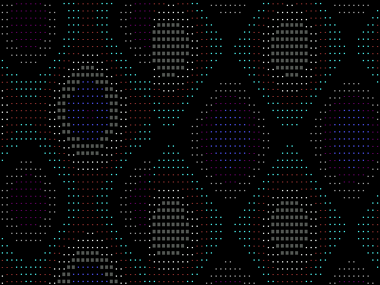

# Plasa Effect Demo for Zeal 8-bit Computer

This is a classic Plasma Effect Demo for Zeal 8-bit computer.  It was ported over from a demo for the C64.

This repo contains an implementation in both C and Z80 ASM

## Compiling

For Z80 ASM Demo
```shell
make
```

For C Demo
```shell
make -f sdcc.mk
```

By default, the Makefile.sdcc calls `clean`, to build both you can use

```shell
make -f sdcc.mk && make
```

## Screenshots

<figure>

<figcaption><i>Z80 ASM Plasma Demo</i></figcaption>
</figure>

<figure>

<figcaption><i>C Plasma Demo</i> - The C implementation is so slow, that you can see the rendering occur row by row.</figcaption>
</figure>

## CREDIT

Original Commodore 64 code obtained from [this video](https://www.youtube.com/watch?v=w93AncybKaY) by [Commodoreretro-programming](https://www.youtube.com/@Commodoreretro-programming) on YouTube.